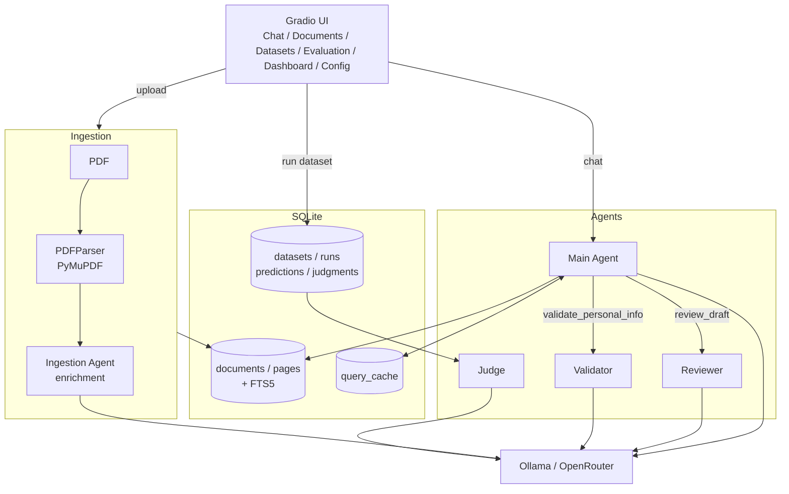

# 


A multi-agent PDF assistant with a built-in evaluation harness. Chat with documents, build evaluation datasets from real conversations or manual annotations, and score agent answers with a manual or LLM-as-judge workflow — all locally, with Ollama or OpenRouter as the backend.

---

## Highlights

- **Multi-agent pipeline** — a main agent backed by reviewer, validator, ingestion, and judge agents (pydantic-ai).
- **Two interchangeable backends** — Ollama (local) and OpenRouter (cloud), selected per-agent in `agents.json`.
- **PDF ingestion** — PyMuPDF parsing with optional LLM enrichment (headings, names, dates, keywords).
- **SQLite + FTS5** — full-text search across every ingested page; query cache to skip repeated LLM calls.
- **Annotation tool** — embedded PDF.js viewer with text/page span staging and Q&A capture.
- **Evaluation harness** — replay datasets through the chat pipeline, score predictions manually or with an LLM judge, aggregate per metric.
- **Versioned config UI** — edit `.env`, `agents.json`, and `prompts.json` from the browser; every save is snapshotted.
- **Personal info validation** — optional validator agent checks document claims against a JSON profile.

---

## Quick start

**Prerequisites:** Python 3.10+, [`uv`](https://github.com/astral-sh/uv), and at least one LLM backend.

```bash
git clone <your-fork-or-repo>.git Doc2Agent
cd Doc2Agent
uv sync
cp env.example .env
make run
```

The app opens at `http://localhost:7860`.

### Pick a backend

Doc2Agent ships with two backends defined in `src/agents_config/agents.json`. `default_backend` is `local`; each agent can override.

**Option A — Ollama (local).** Pull the models you want and point each agent at them:

```bash
ollama pull llama3.1:8b
ollama pull deepseek-r1:8b
```

Then in `agents.json`, set each agent's `"backend": "local"` and `"model"` to a tag you've pulled (or use `${DEFAULT_MID}` etc. and define those in `.env`).

**Option B — OpenRouter (cloud).** Add your key to `.env`:

```bash
OPENROUTER_API_KEY=sk-or-...
```

Then set each agent's `"backend": "openrouter"` and pick a model slug (e.g. `anthropic/claude-sonnet-4.6`, `deepseek/deepseek-v3.2`).

You can mix — e.g. ingestion on local Ollama, judge on OpenRouter — by setting `backend` per agent.

---

## Architecture



**Flow.** PDF upload → PyMuPDF extracts pages → ingestion agent enriches each page → stored in SQLite with FTS5. A chat turn hits the query cache first; on miss, the main agent searches pages, drafts an answer, optionally calls reviewer/validator, and the result is cached. Evaluation runs replay dataset annotations one-turn-each through the same pipeline; the judge then scores predictions.

For deeper detail see [`docs/architecture.md`](docs/architecture.md).

---

## Agents

Defined in `src/agents_config/agents.json`; prompts in `src/agents_config/prompts.json`.

| Agent       | Role                                                              | Default model (shipped)        |
|-------------|-------------------------------------------------------------------|--------------------------------|
| `main`      | Orchestrates the chat turn; calls tools and other agents          | `anthropic/claude-sonnet-4.6`  |
| `reviewer`  | Reviews the main agent's draft for accuracy                       | `deepseek/deepseek-v3.2`       |
| `validator` | Checks claims against `PERSONAL_INFO_JSON` (opt-in)               | `deepseek/deepseek-v3.2`       |
| `ingestion` | Adds headings, dates, keywords, etc. to each page during upload   | `deepseek/deepseek-v3.2`       |
| `judge`     | Scores predictions per metric in LLM-as-judge mode                | `deepseek/deepseek-v3.2`       |

`agents.openrouter.json` is a ready-made alternative profile (lighter models). Use `AGENTS_CONFIG_PATH` to point at it.

---

## Pages

The Gradio app has a navbar with one route per page; some pages have inner tabs.

- **Chat** — upload a PDF, ask questions, manage cached queries and chat sessions. Includes "Clean Empty Sessions (Except Current)".
- **Documents** — browse cached PDFs with PDF preview and enrichment metadata; bulk-delete supported.
- **Datasets**
  - *Live Chat Datasets*: turn chat sessions into evaluation datasets (Auto = every turn, Manual = pick messages).
  - *Annotate Documents*: PDF.js viewer with text/page span staging; capture Q&A and push the set into a dataset (new or existing).
- **Evaluation**
  - *Execution Run*: pick a dataset, optionally override agent config, replay each annotation as a one-turn query; per-prediction status, answer, thoughts, doc reference, and errors are stored.
  - *Judge Run*: pick a run + metrics, score manually (per-prediction navigation) or run the LLM judge for `{score, reason}` per prediction × metric.
- **Dashboard**
  - *Data*: KPIs and tables for documents, annotation sets, datasets.
  - *Evaluations*: KPIs, run/judge tables, per-judge-run × metric pivot, global metric rollup, and failure inspection (failed predictions, low-score judgments, missing doc references).
- **Metrics** — CRUD for reusable scoring metrics (`bool | int | float`, aggregation `avg | sum | min | max`, optional min/max range, optional LLM judge prompt).
- **Config**
  - *System*: edit every supported `.env` variable from the browser. Live-applicable settings save instantly; restart-required ones use *Save & Restart*. Each save is versioned.
  - *Agent Config*: edit `agents.json` and `prompts.json` with version snapshots, so evaluation runs can pin a specific config version.
- **Ad-hoc** — experimental utilities (e.g. *Switch File ID* to repoint annotations at a different document).

---

## How-tos

### Chat with a PDF

1. Open **Chat**, upload a PDF in the sidebar, wait for ingestion.
2. Ask a question. Cache hits return immediately; misses run the agent and are cached (up to `QUERY_CACHE_MAX_PER_FILE` per doc).
3. Use the session dropdown to switch conversations; *Flush Cache* clears cached answers for the current document.

### Build a dataset from a chat session

1. **Datasets → Live Chat Datasets**.
2. Create or pick a dataset, pick a chat session, choose **Auto** (every turn) or **Manual** (cherry-pick messages), click **Add to dataset**.
3. The same dataset can aggregate turns from multiple sessions. Export as JSON from the preview pane.

### Annotate a PDF and push it into a dataset

1. **Datasets → Annotate Documents**.
2. Pick or upload a PDF, create an **annotation set**.
3. Stage spans (text selection or whole page), enter the Q&A, **Save**.
4. In the same tab's sidebar, select an existing dataset and **Add set → dataset**, or create a new one with **Create & add set**.

### Run an evaluation

1. Define metrics in **Metrics** if you don't have any yet.
2. **Evaluation → Execution Run**: pick a dataset, name the run, optionally pin agent/general config versions, click **Run**.
3. Each annotation is replayed as a one-turn query against its referenced document. The results table shows question, expected answer, agent answer, doc, status, and any error.

### Score predictions

1. **Evaluation → Judge Run**: pick the run + one or more metrics.
2. **Manual**: navigate prediction-by-prediction, enter score + comment per metric.
3. **LLM**: the judge model is given the metric description, the metric's optional judge prompt, the question/expected/agent answers, and any context, and returns `{score, reason}` per prediction × metric.
4. Per-metric aggregates roll up live using each metric's declared aggregation.

### Edit agents and prompts from the UI

1. **Config → Agent Config**: edit `agents.json` or `prompts.json`, save. A snapshot is written under `src/config_versions/`.
2. In **Evaluation → Execution Run**, pin a specific agent-config version for the run so it's reproducible.

### Switch backends (Ollama ↔ OpenRouter)

Edit `src/agents_config/agents.json` (or do it in **Config → Agent Config**): for each agent set `"backend"` to `"local"` or `"openrouter"` and update `"model"` accordingly. To swap configs wholesale, set `AGENTS_CONFIG_PATH=src/agents_config/agents.openrouter.json`.

---

## Configuration

Copy `env.example` → `.env`. Every setting is also editable from **Config → System**.

### Backends

| Variable             | Default                          | Description                                       |
|----------------------|----------------------------------|---------------------------------------------------|
| `OLLAMA_BASE_URL`    | `http://localhost:11434/v1`      | Ollama API endpoint                               |
| `OPENROUTER_API_KEY` | —                                | Required if any agent uses `backend: openrouter`  |

### Default models (referenced by `agents.json` via `${VAR}`)

| Variable         | Description                                   |
|------------------|-----------------------------------------------|
| `DEFAULT_MODEL`  | Generic fallback model                        |
| `DEFAULT_LIGHT`  | Lightweight model (e.g. for ingestion)        |
| `DEFAULT_MID`    | Mid-tier model (e.g. main agent)              |
| `DEFAULT_HIGH`   | High-tier model (e.g. reviewer)               |

`agents.json` substitutes `${VAR}` at load time. Unset references fail fast at startup.

### PDF storage and ingestion

| Variable               | Default       | Description                                        |
|------------------------|---------------|----------------------------------------------------|
| `PDF_SQLITE_DIR`       | `data`        | SQLite DB directory                                |
| `PDF_STORAGE_DIR`      | `data/pdfs`   | Permanent PDF file storage                         |
| `PDF_JSON_DIR`         | `data`        | Optional JSON export directory for small docs      |
| `PDF_JSON_MAX_BYTES`   | `2000000`     | Max file size to also dump as JSON                 |
| `USE_ENRICHMENT`       | `true`        | Run the ingestion agent on each page               |
| `SHOW_INGESTION_LOGS`  | `false`       | Stream per-page enrichment progress in the chat UI |

### Query cache

| Variable                    | Default | Description                          |
|-----------------------------|---------|--------------------------------------|
| `QUERY_CACHE_ENABLED`       | `true`  | Toggle the query cache               |
| `QUERY_CACHE_MAX_PER_FILE`  | `10`    | Max cached queries per document      |
| `INLINE_DOC_MAX_CHARS`      | `20000` | Inline the doc into the prompt below this size |

### Evaluation and judge

| Variable             | Default     | Description                                              |
|----------------------|-------------|----------------------------------------------------------|
| `EVAL_CONCURRENCY`   | `1`         | Parallel annotations per execution run                   |
| `EVAL_MAX_SAMPLES`   | —           | Cap on annotations per run                               |
| `EVAL_SHUFFLE`       | `false`     | Shuffle dataset before running                           |
| `EVAL_SEED`          | —           | Seed for shuffling                                       |
| `EVAL_CONTEXT_MODE`  | `full_doc`  | `full_doc` \| `spans_only` \| `question_only`            |
| `JUDGE_CONCURRENCY`  | `1`         | Parallel `(prediction × metric)` judgments. Keep at 1 for local Ollama |

### Personal info validation

| Variable              | Description                                                                 |
|-----------------------|-----------------------------------------------------------------------------|
| `PERSONAL_INFO_JSON`  | JSON object (`{"name":"...","email":"..."}`) the validator checks claims against |

### Logging

| Variable           | Default      | Description                                            |
|--------------------|--------------|--------------------------------------------------------|
| `LOG_LEVEL`        | `INFO`       | `DEBUG` \| `INFO` \| `WARNING` \| `ERROR`              |
| `LOG_TO_FILE`      | `true`       | Write logs to file                                     |
| `LOG_FILE_PREFIX`  | `Doc2Agent`  | Auto-named log: `logs/{prefix}_{YYYYMMDD_HHMMSS}.log`  |
| `LOG_TO_STDOUT`    | `false`      | Also stream to terminal                                |

The startup banner prints the resolved log file path.

### Misc

| Variable                | Default                                  | Description                              |
|-------------------------|------------------------------------------|------------------------------------------|
| `ASSISTANT_NAME`        | `Doc2Agent`                              | App display name                         |
| `SHOW_REASONING`        | `true`                                   | Parse `<think>` tags (deepseek-r1, qwq)  |
| `AGENTS_CONFIG_PATH`    | `src/agents_config/agents.json`          | Path to the agent config to load         |
| `PROMPTS_CONFIG_PATH`   | `src/agents_config/prompts.json`         | Path to the prompts config to load       |

---

## Storage

A single SQLite database (under `PDF_SQLITE_DIR`) holds everything:

- `documents`, `pages`, `pages_fts` — ingested PDFs + FTS5 index.
- `query_cache` — cached chat answers per document.
- `chat_sessions`, `chat_messages` — chat history.
- `annotation_sets`, `annotations`, `annotation_spans` — manual annotations and their span references.
- `datasets`, `dataset_annotations` — datasets and the annotations they include.
- Evaluation tables — runs, predictions, judge runs, per-metric judgments.

---

## Project layout

```
Doc2Agent/
├── app/
│   ├── gradio_app.py          # Entry point; defines all routes
│   ├── pdf_ingest.py          # Upload + ingestion handlers
│   ├── annotation_tab.py      # Datasets → Annotate Documents
│   ├── datasets_tab.py        # Datasets → Live Chat Datasets
│   ├── documents_tab.py       # Documents page
│   ├── evaluation_tab.py      # Evaluation: Execution Run, Judge Run, Metrics
│   ├── dashboard_tab.py       # Dashboard: Data + Evaluations
│   ├── system_tab.py          # Config → System (.env editor)
│   ├── agent_config_tab.py    # Config → Agent Config (agents.json / prompts.json)
│   ├── adhoc_tab.py           # Ad-hoc utilities
│   ├── ui_components.py       # Reusable UI helpers
│   ├── utils.py               # Framework-agnostic helpers
│   └── static/annotator.js    # PDF.js viewer + span bridge
├── src/
│   ├── agents/                # base, main, reviewer, ingestion, tooling
│   ├── agents_config/         # agents.json, agents.openrouter.json, prompts.json, schemas
│   ├── annotation/            # annotation helpers
│   ├── chat/assistant.py      # Chat orchestration
│   ├── config/                # env_schema, env_writer (versioned saves)
│   ├── config_versions/       # Snapshot history for system + agent configs
│   ├── evaluation/            # runner.py (replay), judge.py (manual + LLM judge)
│   ├── schemas/               # document, annotation, evaluation models
│   ├── storage/sqlite_store.py
│   ├── tools/                 # pdf, pdf_parser, retrieval
│   ├── bootstrap.py           # init_app
│   └── logging.py
├── tests/unit/                # pytest suites per package
├── docs/                      # architecture, blueprint
└── data/                      # SQLite DB + stored PDFs (gitignored)
```

---

## Development

```bash
make run         # uv run python app/gradio_app.py
make test        # uv run pytest
make lint        # black + isort
make lint-check  # black --check + isort --check-only
```

Tests live under `tests/unit/` covering agents, chat, storage, evaluation, config, and tools.

---

## Contributing

Issues and PRs welcome. Before pushing, please run `make lint` and `make test`. New code should follow the existing module layout (`app/` for UI, `src/` for everything else) and stay framework-agnostic where it can — Gradio touches only `app/`.

---

## License

MIT — see [LICENSE](LICENSE).
