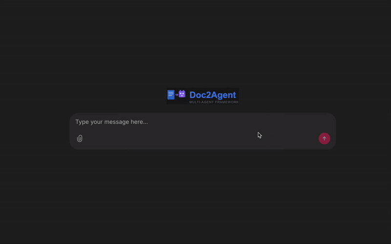
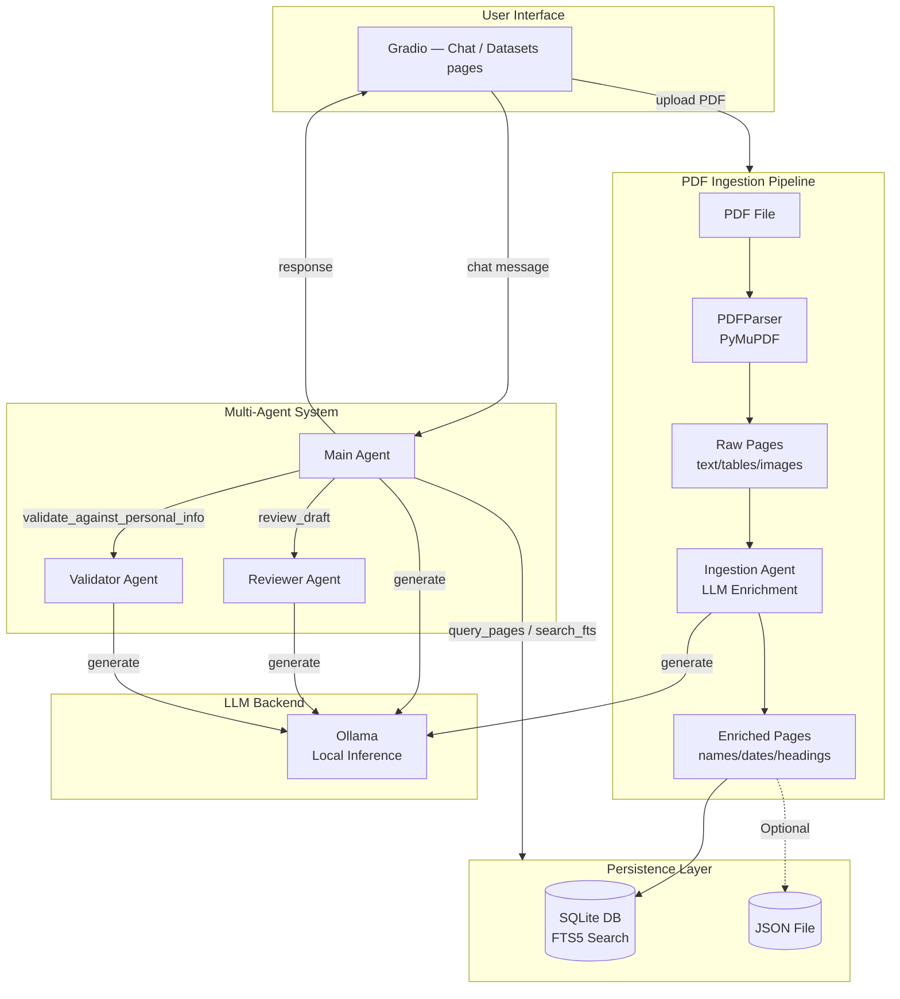

# 




**Intelligent PDF Assistant with Multi-Agent Architecture**

Doc2Agent is a document Q&A system that combines local LLM inference with a multi-agent architecture. Upload PDFs, ask questions, and get answers powered by local models running on your machine.

---

## Overview

Doc2Agent transforms static PDF documents into interactive knowledge bases. Using a multi-agent system with specialized roles, it provides accurate, context-aware answers to your questions while maintaining complete privacy through local inference.

**Key Capabilities:**
- Intelligent PDF parsing and semantic enrichment
- Multi-agent collaboration for quality assurance
- Local-first architecture with Ollama integration
- Full-text search with SQLite FTS5
- Query caching for improved performance
- Personal information validation
- Configurable logging (file by default + optional terminal stream)
- File-based configuration (agents/models/backends and prompts)
- **Multi-page UI** with a navbar:
  - **Chat** — Q&A with the agents (with a one-click "clean empty sessions" button)
  - **Datasets** — two tabs: *Live Chat Datasets* (turn chat sessions into eval sets) and *Annotate Documents* (PDF.js viewer + span staging + push annotation sets into a dataset)
  - **Dashboard** — two tabs: *Data* (documents, annotation sets, datasets) and *Evaluations* (runs, judge runs, metric rollups, failure inspection)

---

## Quick Start

### Prerequisites

- Python 3.10 or higher
- [Ollama](https://ollama.com/download) installed and running
- `uv` package manager (or pip)

### Installation

1. **Install Ollama models:**
```bash
ollama pull ministral-3:3b
ollama pull deepseek-r1:8b
```

2. **Install dependencies:**
```bash
uv sync
```

3. **Configure environment:**
```bash
cp env.example .env
```

4. **Start the application:**
```bash
make run
```

5. **Access the web UI** (typically `http://localhost:7860`). The home page shows a light/dark-aware logo, a short tagline, and **Chat** / **Datasets** buttons; the top bar links to the same two routes:
   - **Chat** (`/chat`) — Q&A with the agents
   - **Datasets** (`/datasets`) — two tabs: build datasets from live chat sessions or from manually annotated documents

---

## Features

### PDF Ingestion Pipeline

- **PyMuPDF-based parsing**: Extracts text, tables, and images with high fidelity
- **LLM enrichment**: Automatically identifies names, dates, headings, and keywords
- **Smart caching**: Documents are cached based on modification time to avoid reprocessing
- **Flexible storage**: Large documents stored in SQLite; optional JSON export for smaller files

### Multi-Agent System

- **Main Agent**: Orchestrates queries and coordinates with specialized agents
- **Reviewer Agent**: Reviews draft answers for quality and accuracy
- **Validator Agent**: Validates claims against user-provided personal information
- **Ingestion Agent**: Enriches document pages with semantic metadata

### Storage & Retrieval

- **SQLite with FTS5**: Full-text search across all ingested documents
- **Query caching**: Intelligent caching system reduces redundant LLM calls
- **Document management**: Load, select, and manage multiple documents from the UI
- **Annotations**: Same SQLite DB as chat; separate tables for sets, Q&A rows, and spans
- **Cache management**: Built-in cache flushing and automatic cleanup

### User Interface

- **Gradio multi-page app** with a navbar:
  - **Chat** page: upload, agents, cache, sessions. Includes **Clean Empty Sessions (Except Current)** to prune empty sessions in one click.
  - **Datasets** page:
    - *Live Chat Datasets* tab: pick a chat session, choose Auto/Manual, export turns as `Annotation`s into a `Dataset`. One dataset can aggregate multiple sessions.
    - *Annotate Documents* tab: PDF.js viewer + span staging (text / page-based), Q&A capture, JSON export. Push the whole annotation set into an existing or new dataset — stored the same way as chat-exported ones (annotations + spans + doc reference in SQLite).
- **Document upload**: PDF upload with progress tracking (chat may enrich pages; Annotate parses only)
- **Document selection**: Switch between multiple cached documents
- **Query history**: View and manage cached queries per document
- **Inline traces**: Live status updates while checking cache/running agent

### Logging

- Logs to file by default and prints the resolved log file path on startup.
- Optional terminal streaming via `LOG_TO_STDOUT=true`.
- Configurable via: `LOG_LEVEL`, `LOG_TO_FILE`, `LOG_FILE`, `LOG_TO_STDOUT`.

### Configuration

- Environment-driven: copy `env.example` → `.env`.
- File-driven (editable JSON): `src/agents_config/agents.json`, `src/agents_config/prompts.json`.

---

## Architecture



**Data Flow:**
1. User uploads PDF → Ingestion pipeline parses and enriches pages
2. Enriched pages stored in SQLite with full-text search capabilities
3. User asks question → Main agent queries storage and generates response
4. Reviewer agent validates answer quality
5. Validator agent checks against personal info (if configured)
6. Final answer returned to user interface

For detailed architecture documentation, see [docs/architecture.md](docs/architecture.md).

---

## Configuration

### Environment Variables

#### LLM Backend

| Variable | Default | Description |
|----------|---------|-------------|
| `OLLAMA_BASE_URL` | `http://localhost:11434/v1` | Ollama API endpoint |
| `OPENROUTER_API_KEY` | - | OpenRouter API key for cloud inference (set and switch backend in `agents.json`) |

#### Personal Information

| Variable | Description |
|----------|-------------|
| `PERSONAL_INFO_JSON` | JSON object with user's personal data: `{"name":"...","email":"..."}` |

#### PDF Storage

| Variable | Default | Description |
|----------|---------|-------------|
| `PDF_JSON_MAX_BYTES` | `2000000` | Max file size (bytes) for JSON storage |
| `PDF_SQLITE_DIR` | `data` | Directory for SQLite database files |
| `PDF_STORAGE_DIR` | `data/pdfs` | Directory for permanent PDF file storage |

#### Query Processing

| Variable | Default | Description |
|----------|---------|-------------|
| `INLINE_DOC_MAX_CHARS` | `20000` | Max characters to inline in prompt |
| `SHOW_REASONING` | `true` | Display `<think>` tags in UI |
| `SHOW_INGESTION_LOGS` | `false` | Stream per-page ingestion progress in chat UI |

#### Query Caching

| Variable | Default | Description |
|----------|---------|-------------|
| `QUERY_CACHE_ENABLED` | `true` | Enable/disable query caching |
| `QUERY_CACHE_MAX_PER_FILE` | `10` | Max cached queries per document |

**Note:** Cached queries are automatically deleted when documents are removed. Use the "Flush Cache" button in the UI to manually clear cached queries.

#### Logging

| Variable | Description |
|----------|-------------|
| `LOG_LEVEL` | Logging level (DEBUG, INFO, WARNING, ERROR) |
| `LOG_FILE` | Path to log file |
| `LOG_TO_FILE` | Enable file logging (true/false, default: true) |
| `LOG_TO_STDOUT` | Stream logs to terminal in addition to file (true/false, default: false) |

### Config files

- **Agent/model/backend config**: `src/agents_config/agents.json` (and `src/agents_config/agents.openrouter.json`)
- **Prompts**: `src/agents_config/prompts.json` (system prompts are fully editable here)

---

## Tech Stack

- **UI Framework**: [Gradio](https://github.com/gradio-app/gradio) — multi-page app (Chat / Datasets) with client-side PDF rendering via PDF.js
- **Agent Framework**: [pydantic-ai](https://github.com/pydantic/pydantic-ai) - Type-safe AI agents
- **LLM Backend**: [Ollama](https://ollama.com/) - Local LLM inference
- **PDF Processing**: [PyMuPDF (fitz)](https://pymupdf.readthedocs.io/) - High-performance PDF parsing
- **Storage**: SQLite with FTS5 - Full-text search and document persistence
- **Configuration**: python-dotenv - Environment variable management
- **Package Management**: uv - Fast Python package manager

---

## Project Structure

```
Doc2Agent/
├── app/
│   ├── gradio_app.py             # Gradio UI entry point (homepage + Chat/Datasets routes)
│   ├── annotation_tab.py         # Annotate Documents tab (lives on the Datasets page)
│   ├── datasets_tab.py           # Live Chat Datasets tab (lives on the Datasets page)
│   ├── static/annotator.js       # PDF.js viewer + span bridge
│   └── utils.py                  # UI utilities (framework-agnostic)
├── src/
│   ├── agents/
│   │   ├── base.py              # Agent creation and execution
│   │   ├── main.py              # Main agent implementation
│   │   ├── reviewer.py          # Reviewer agent
│   │   ├── ingestion.py         # Ingestion agent
│   │   └── tooling.py           # Tool registration
│   ├── agents_config/
│   │   ├── agents.json          # Agent configurations
│   │   ├── prompts.json         # System prompts
│   │   └── schemas.py           # Config schemas
│   ├── chat/
│   │   └── assistant.py         # Chat orchestration
│   ├── schemas/
│   │   ├── document.py          # Document and page schemas
│   │   └── annotation.py        # Annotation / span models
│   ├── storage/
│   │   └── sqlite_store.py      # SQLite persistence layer
│   ├── tools/
│   │   ├── pdf_parser.py        # PDFParser (PyMuPDF)
│   │   ├── pdf.py               # Legacy PDF tools
│   │   └── retrieval.py         # Search utilities
│   ├── bootstrap.py             # Application initialization
│   └── logging.py               # Logging setup
├── tests/                       # Unit tests
├── docs/                        # Documentation
├── data/                        # Data storage (SQLite, PDFs, JSON)
└── uploads/                     # Temporary upload directory
```

---

## Development

### Code Quality

```bash
make lint       # Format code with black and isort
make lint-check # Check formatting without modifying files
make test       # Run test suite
```

### Running Tests

```bash
uv run pytest
```

### Project Setup

The project uses `uv` for dependency management. Key commands:

- `uv sync` - Install dependencies
- `uv run <command>` - Run commands in the project environment
- `uv add <package>` - Add a new dependency

---

## Usage

### Basic Workflow

1. **Start the application:**
   ```bash
   make run
   ```

2. **Upload a document:**
   - Click the upload button in the sidebar
   - Select a PDF file
   - Wait for ingestion to complete

3. **Ask questions:**
   - Type your question in the chat interface
   - The system will search the document and generate an answer

4. **Manage documents:**
   - Use the "Cached Documents" dropdown to view and select documents
   - Click "Load" to switch to a cached document
   - Click "Delete" to remove a document, or "Flush Cache" to clear cached queries

### Datasets page

Open **Datasets** from the navbar.

**Live Chat Datasets** tab — create a dataset, pick a chat session, choose:
- **Auto** — exports every (user, assistant) turn as an `Annotation` (with retrieved context + reasoning trace as evidence spans).
- **Manual** — pick the specific user messages to include.

A single dataset can aggregate turns from multiple sessions. The preview pane shows current contents and offers a JSON export.

**Annotate Documents** tab — pick or upload a PDF, create/select an **annotation set**, stage spans (text selection or page), enter Q&A, **Save**. Then, in the same tab's sidebar, either select an existing dataset and click **Add set → dataset**, or type a name under **Or create new dataset** and click **Create & add set**. Annotations + spans + the doc reference are stored alongside chat-exported ones.

### Advanced Features

- **Multiple documents**: Upload and switch between multiple PDFs
- **Query caching**: Frequently asked questions are cached for faster responses
- **Personal info validation**: Configure personal information to validate document claims
- **Reasoning traces**: Enable `SHOW_REASONING=true` to see agent reasoning steps

---

## License

MIT License - see LICENSE file for details
