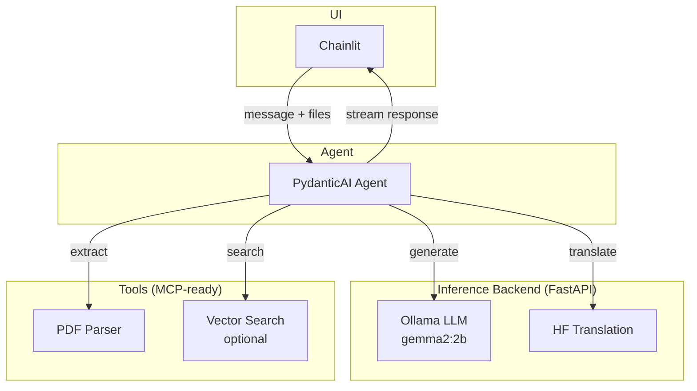

# Architecture

> **Goal**: Personal local document Q&A agent — Chainlit UI → PydanticAI agent → Ollama LLM, with tools for PDF extraction, translation (HF), and optional vector search.

---

## High-level design



---

## Components

| Layer | Component | Responsibility |
|-------|-----------|----------------|
| **UI** | Chainlit | Chat interface, file uploads, session state, response streaming |
| **Agent** | PydanticAI | Orchestration, system prompt, output schema, tool dispatch |
| **Backend** | FastAPI + Ollama | LLM inference (`gemma2:2b`), model swapping |
| | HF Translation | Translate queries/documents (Helsinki-NLP, etc.) |
| **Tools** | PDF tool | Extract text, chunk, normalize |
| | Translation tool | Wrap HF backend for agent use |
| | Search tool (opt) | Embed chunks, vector similarity search |
| **Core** | Logging | Structured logs (JSON) across all layers |
| | Tests | Pytest: PDF parsing, translation, agent smoke tests |

*Tools can be exposed as MCP servers for reusability across agents.*

---

## Directory layout

```
myagent/
├── app/
│   ├── main.py                 # Chainlit entrypoint
│   ├── agent/
│   │   ├── agent.py            # PydanticAI agent
│   │   └── schemas.py          # I/O schemas
│   ├── tools/
│   │   ├── pdf.py              # extract_text(), chunk()
│   │   ├── translate.py        # translate_text()
│   │   └── search.py           # embed/search (optional)
│   ├── backends/
│   │   ├── api.py              # FastAPI app
│   │   ├── ollama_backend.py   # Ollama wrapper
│   │   └── hf_translate.py     # HF translation wrapper
│   └── core/
│       ├── settings.py         # env/config
│       └── logging.py          # structured logger
├── tests/
│   ├── test_pdf.py
│   ├── test_translate.py
│   └── test_agent.py
├── docs/
├── pyproject.toml
└── README.md
```

---

## Request flow

1. **User** sends message (+ optional PDF) via Chainlit
2. **Agent** receives input, decides tool sequence:
   - `pdf.extract_text()` → chunks
   - `translate.translate_text()` if non-English
   - `search.query()` if vector DB enabled
3. **Agent** calls Ollama backend for LLM completion
4. **Response** streamed back to Chainlit

---

## Tech stack

- **UI**: Chainlit
- **Agent**: pydantic-ai
- **LLM**: Ollama (gemma2:2b)
- **Translation**: transformers (Helsinki-NLP)
- **PDF**: PyMuPDF or pdfplumber
- **Embeddings** (opt): sentence-transformers + chromadb
- **API**: FastAPI
- **Logging**: structlog
- **Tests**: pytest
