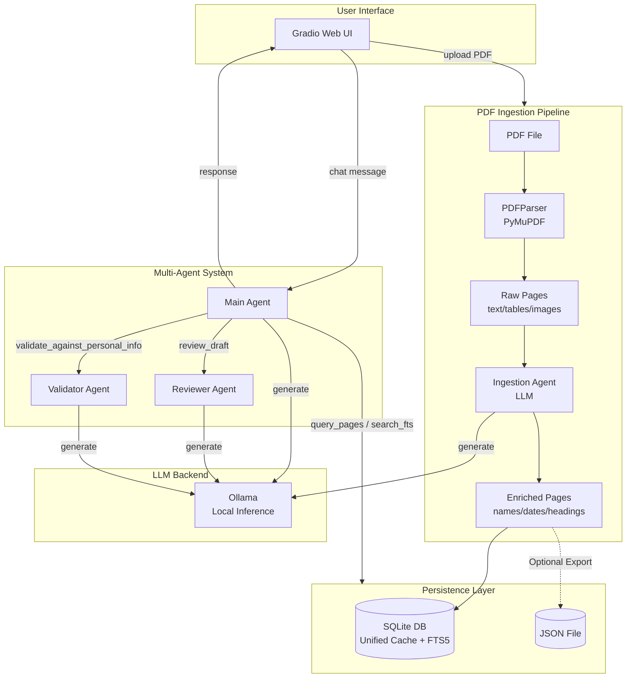
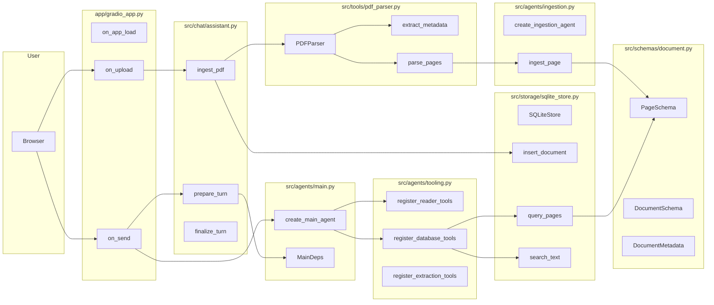
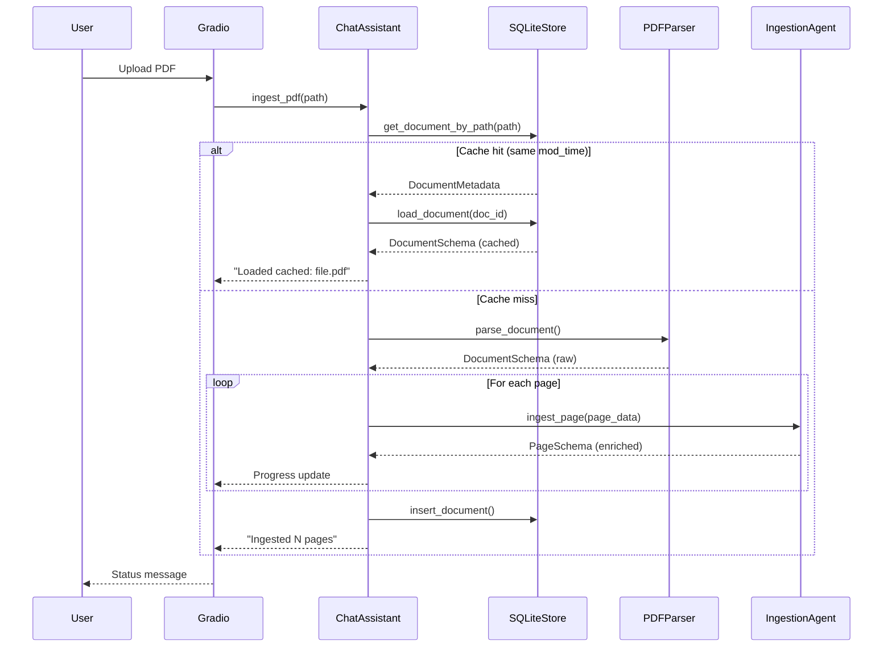
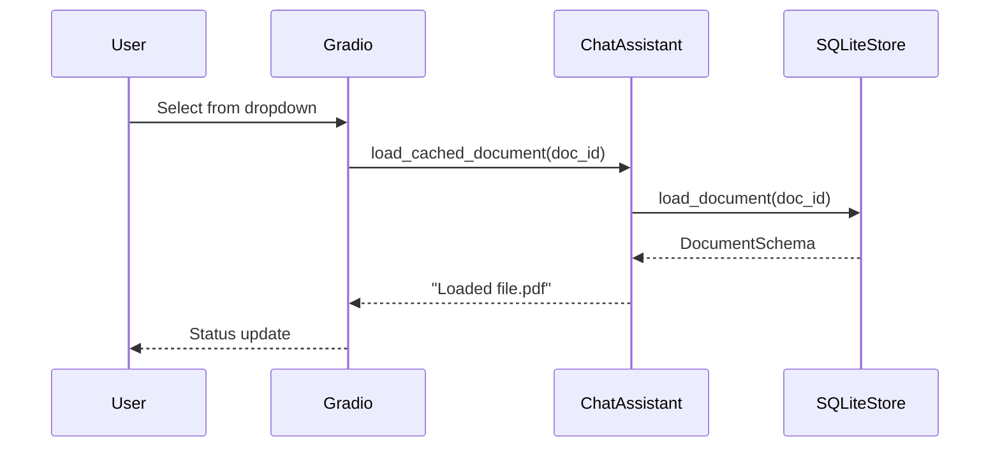
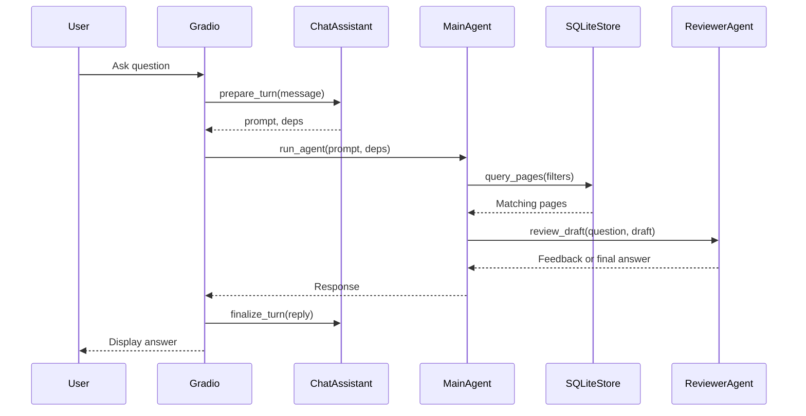

# Architecture

> **Goal**: Personal local document Q&A agent — Gradio UI → Multi-agent system → Ollama LLM, with PDF ingestion, SQLite storage, and semantic page querying.

---

## High-level Design



---

## Full System Diagram



---

## Components

| Layer | Component | Responsibility |
|-------|-----------|----------------|
| **UI** | Gradio | Tabbed chat interface, file uploads, session state |
| **Chat** | ChatAssistant | Orchestrates ingestion and chat turns |
| **Agents** | Main Agent | Answers questions using tools |
| | Reviewer Agent | Reviews draft answers for quality |
| | Validator Agent | Validates claims against personal info |
| | Ingestion Agent | Enriches pages with semantic metadata |
| **Tools** | PDFParser | PyMuPDF-based PDF extraction |
| | Database Tools | query_pages, get_all_pages, search_fts |
| | Reader Tools | search_document, get_section |
| **Storage** | SQLiteStore | Documents/pages persistence with FTS5 |
| **Schemas** | PageSchema | Page-level metadata and content |
| | DocumentSchema | Full document with metadata + pages |

---

## Directory Layout

```
Doc2Agent/
├── app/
│   ├── gradio_app.py              # Gradio UI entry point
│   └── utils.py                   # Framework-agnostic utilities
├── src/
│   ├── agents/
│   │   ├── base.py              # create_agent, run_agent
│   │   ├── main.py              # Main agent + MainDeps
│   │   ├── reviewer.py          # Reviewer agent
│   │   ├── ingestion.py         # Ingestion agent for page enrichment
│   │   └── tooling.py           # Tool registration
│   ├── agents_config/
│   │   ├── agents.json          # Agent configs (model, backend)
│   │   ├── prompts.json         # System prompts
│   │   └── schemas.py           # Config schemas
│   ├── chat/
│   │   └── assistant.py         # ChatAssistant orchestrator
│   ├── schemas/
│   │   └── document.py          # PageSchema, DocumentSchema
│   ├── storage/
│   │   └── sqlite_store.py      # SQLite persistence + FTS
│   ├── tools/
│   │   ├── pdf.py               # Legacy pypdf tools
│   │   ├── pdf_parser.py        # PDFParser (PyMuPDF)
│   │   └── retrieval.py         # Search utilities
│   ├── bootstrap.py             # App initialization
│   └── logging.py               # Logging setup
├── tests/
├── docs/
│   ├── architecture.md          # This file
│   └── local_design.md          # Refactoring design doc
├── pyproject.toml
├── env.example
└── README.md
```

---

## Data Flow

### PDF Ingestion (Cache-First)



### Document Selection



### Chat Query



---

## Configuration

### Environment Variables

| Variable | Default | Description |
|----------|---------|-------------|
| `OLLAMA_BASE_URL` | `http://localhost:11434/v1` | Ollama endpoint |
| `INLINE_DOC_MAX_CHARS` | `20000` | Max chars to inline in prompt |
| `PDF_SQLITE_DIR` | `data` | Directory for SQLite database files |
| `PDF_JSON_DIR` | `data` | Directory for optional JSON export |
| `PDF_JSON_MAX_BYTES` | `2000000` | Max file size for JSON export |
| `USE_ENRICHMENT` | `true` | Enable LLM page enrichment |
| `SHOW_REASONING` | `true` | Show `<think>` tags in UI |
| `PERSONAL_INFO_JSON` | - | JSON with user's personal data |

### Agent Configs

Defined in `src/agents_config/agents.json`:

```json
{
  "main": { "model": "ministral-3:3b", "temperature": 0.2 },
  "reviewer": { "model": "deepseek-r1:8b", "temperature": 0.1 },
  "validator": { "model": "ministral-3:3b", "temperature": 0.1 },
  "ingestion": { "model": "ministral-3:3b", "temperature": 0.0 }
}
```

---

## Tech Stack

- **UI**: Gradio
- **Agents**: pydantic-ai
- **LLM**: Ollama (local inference)
- **PDF**: PyMuPDF (fitz)
- **Storage**: SQLite + FTS5
- **Config**: python-dotenv

---

## Running

```bash
# Install dependencies
uv sync

# Configure
cp env.example .env

# Start Ollama
ollama serve

# Run the app
make run
```
