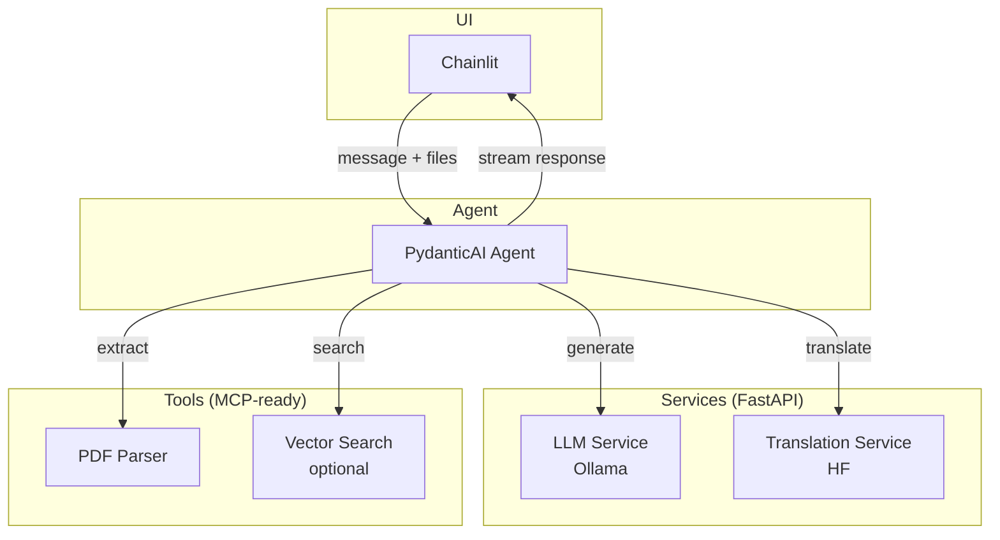

# Architecture

> **Goal**: Personal local document Q&A agent — Chainlit UI → PydanticAI agent → Ollama LLM, with tools for PDF extraction, translation (HF), and optional vector search.

---

## High-level design



---

## Components

| Layer | Component | Responsibility |
|-------|-----------|----------------|
| **UI** | Chainlit | Chat interface, file uploads, session state, response streaming |
| **Agent** | PydanticAI | Orchestration, system prompt, output schema, tool dispatch |
| **Services** | LLM Service | FastAPI + Ollama inference |
| | Translation Service | HF translation (Helsinki-NLP) |
| **Tools** | PDF tool | Extract text, chunk, normalize |
| | Translation tool | Wrap translation service for agent |
| | Search tool (opt) | Embed chunks, vector similarity search |
| **Core** | Config | Centralized settings from .env |
| | Logging | Structured logs across all layers |
| | Tests | Pytest: PDF parsing, translation, agent smoke tests |

---

## Directory layout

```
myagent/
├── src/
│   ├── __init__.py
│   ├── config.py                     # Shared config from .env
│   │
│   ├── schemas/                      # Pydantic I/O models
│   │   ├── __init__.py
│   │   ├── llm.py                    # LLMRequest, LLMResponse
│   │   ├── translation.py            # TranslationRequest, TranslationResponse
│   │   └── agent.py                  # AgentInput, AgentOutput (planned)
│   │
│   ├── services/                     # FastAPI microservices
│   │   ├── __init__.py
│   │   ├── llm/
│   │   │   ├── __init__.py
│   │   │   └── server.py             # /generate endpoint (Ollama)
│   │   └── translation/
│   │       ├── __init__.py
│   │       └── server.py             # /translate endpoint (HF)
│   │
│   ├── agent/                        # PydanticAI agent (planned)
│   │   ├── __init__.py
│   │   ├── agent.py                  # Agent definition, system prompt
│   │   └── deps.py                   # Agent dependencies (service clients)
│   │
│   ├── tools/                        # Agent tools (planned)
│   │   ├── __init__.py
│   │   ├── pdf.py                    # extract_text(), chunk()
│   │   ├── translate.py              # translate_text() - calls service
│   │   └── search.py                 # embed(), search() - optional
│   │
│   ├── app/                          # Chainlit UI (planned)
│   │   ├── __init__.py
│   │   └── main.py                   # Chainlit entrypoint
│   │
│   └── scripts/
│       └── run_model.py              # Standalone test script
│
├── scripts/
│   └── start_services.sh             # Start all FastAPI services
│
├── tests/                            # (planned)
│   ├── test_pdf.py
│   ├── test_translate.py
│   └── test_agent.py
│
├── docs/
│   ├── architecture.md
│   └── notes.md
│
├── pyproject.toml
├── env.example
└── README.md
```

---

## Request flow

1. **User** sends message (+ optional PDF) via Chainlit
2. **Chainlit** passes input to PydanticAI agent
3. **Agent** decides tool sequence:
   - `pdf.extract_text()` → text chunks
   - `translate.translate_text()` if non-English
   - `search.query()` if vector DB enabled
4. **Agent** calls LLM service for final response
5. **Response** streamed back to Chainlit UI

---

## Implementation status

| Component | Status |
|-----------|--------|
| LLM Service | ✅ Done |
| Translation Service | ✅ Done |
| Schemas | ✅ Done |
| Config | ✅ Done |
| Start script | ✅ Done |
| Agent | ⏳ Planned |
| Tools (PDF, translate, search) | ⏳ Planned |
| Chainlit UI | ⏳ Planned |
| Tests | ⏳ Planned |

---

## Tech stack

- **UI**: Chainlit
- **Agent**: pydantic-ai
- **LLM**: Ollama (gemma2:2b)
- **Translation**: transformers (Helsinki-NLP)
- **PDF**: PyMuPDF or pdfplumber
- **Embeddings** (opt): sentence-transformers + chromadb
- **API**: FastAPI
- **Tests**: pytest

---

## Running services

```bash
# Copy and configure env
cp env.example .env

# Install dependencies
uv sync

# Start services
./scripts/start_services.sh
```

Endpoints:
- LLM: `POST http://localhost:8001/generate`
- Translation: `POST http://localhost:8002/translate`
